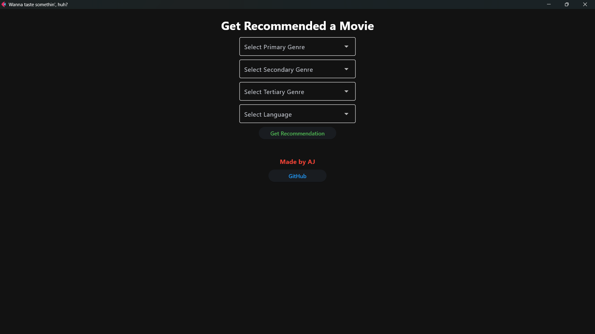
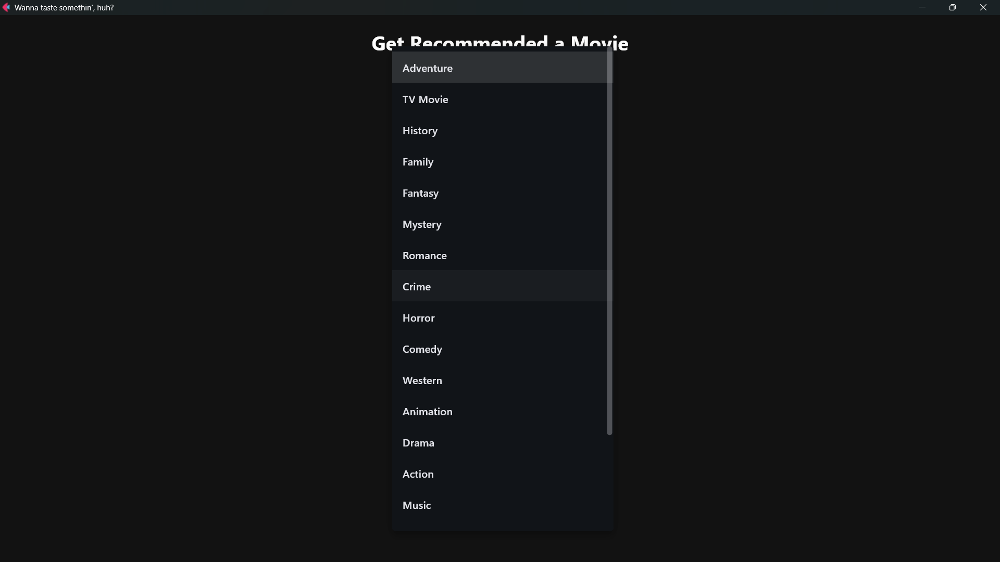
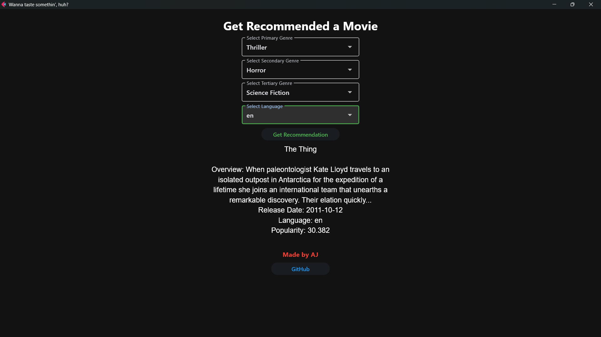

# mov-rec

A Python-based movie recommendation tool built using **Flet**, a UI framework based on **Flutter**, along with **Pandas** for fast data handling.
The app fetches movie data from a `.csv` file, processes it using Pandas, and filters the results based on user input. It then uses genre-based one-hot encoding and applies stepwise filtering (primary, secondary, tertiary genre, and language) to recommend movies. It is designed for speed and interactivity.

## Features

- Built with [Flet](https://flet.dev/), a framework based on Flutter for creating modern, interactive user interfaces in Python.
- **Fast Data Processing**: Uses **Pandas** to efficiently read, process, and filter the movie data from a `.csv` file, ensuring the app can handle large datasets and provide quick updates.
- **Genre One-Hot Encoding**: Movie genres are processed into a one-hot encoded format for efficient filtering and selection.
- **Stepwise Filtering**: Movies are filtered in steps: first by primary genre, then secondary, then tertiary, and finally by language, matching the user's selections.
- **Randomized Recommendation**: From the filtered results, a random movie is selected to provide variety in recommendations.
- **Real-time Recommendations**: The tool updates movie recommendations instantly as the user selects different genres or languages.

## Screenshots

Here are some screenshots of the application in action:

### main-interface



### genre-selection



### result-text



## Prerequisites

Make sure you have the following installed:

- Python 3.11.x or higher
- pip (Python package installer)

## Installation

1. Clone the repository or download the project files.

    ```bash
    git clone https://github.com/ajay-karmakar/mov-rec.git
    cd mov-rec
    ```

2. Install the required dependencies by running:

    ```bash
    pip install -r requirements.txt
    ```

3. Ensure you have the `.csv` file in the same directory as the script, or update the file path in the code.

## Usage

1. Run the Python application using the following command:

    ```bash
    python main.py
    ```

## File Descriptions

- **`.csv`**: This file contains the movie data used by the tool. It includes columns such as `id`, `title`, `genres`, `original_language` and other relevant movie details.
  
- **`requirements.txt`**: Contains a list of Python dependencies required to run the application.

- **`main.py`**: Main Python script that implements the application logic, including genre one-hot encoding and stepwise filtering for recommendations.
